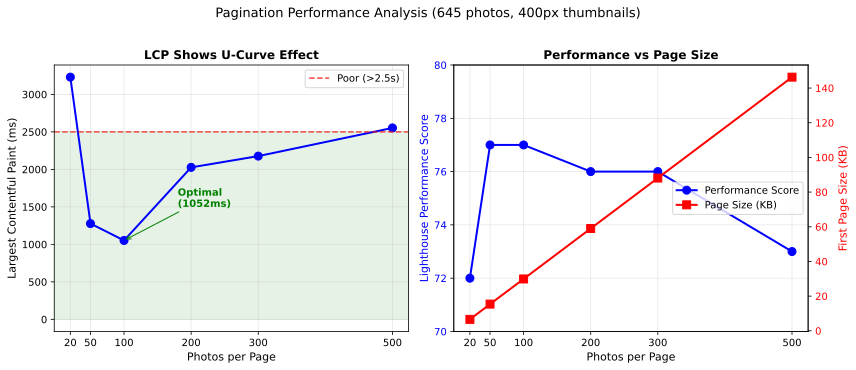

# Pagination Performance Comparison

Benchmark results comparing different `photos_per_page` values for the wedding gallery (645 photos).

## Test Configuration

- **Photo count**: 645
- **Thumbnail size**: 400px
- **Quality**: 85
- **Theme**: minimal

## Metric Glossary

The following metrics are collected via [Lighthouse](https://developer.chrome.com/docs/lighthouse/), Google's web performance auditing tool:

| Metric | Full Name | What It Measures |
|--------|-----------|------------------|
| **Perf** | Performance Score | Overall score 0-100 combining all metrics |
| **FCP** | First Contentful Paint | Time until first text/image renders |
| **LCP** | Largest Contentful Paint | Time until largest visible element renders |
| **CLS** | Cumulative Layout Shift | Visual stability (lower is better, <0.1 is good) |

**LCP thresholds** (per Google): Good <2.5s, Needs Improvement 2.5-4s, Poor >4s


## Methodology

Each test iteration followed this procedure:

### 1. Clean Environment

```bash
pkill -f "site serve"
rm -rf output
```

### 2. Configure Pagination

Edit `config/galleria.json` to set desired `photos_per_page` value, then verify:

```bash
cat config/galleria.json | grep photos_per_page
```

### 3. Build with Benchmark Timing

```bash
uv run site build --benchmark
```

### 4. Measure Output Sizes

```bash
# Page count and sizes
ls output/galleries/wedding/*.html | wc -l
du -sb output/galleries/wedding/page_1.html
du -sb output/galleries/wedding/*.html | awk '{sum+=$1} END {print sum}'
```

### 5. Run Lighthouse

```bash
uv run site serve --no-generate &
sleep 3
CHROME_PATH=/usr/bin/chromium lighthouse \
  http://localhost:8000/galleries/wedding/page_1.html \
  --output=json --output-path=/tmp/lh_result.json \
  --chrome-flags="--headless --no-sandbox"
```

### 6. Extract Metrics

```bash
python3 -c "
import json
d = json.load(open('/tmp/lh_result.json'))
c, a = d['categories'], d['audits']
print(f\"perf:{int(c['performance']['score']*100)} \
fcp:{int(a['first-contentful-paint']['numericValue'])} \
lcp:{int(a['largest-contentful-paint']['numericValue'])} \
cls:{a['cumulative-layout-shift']['numericValue']:.3f}\")
"
```

## Results Summary

| photos_per_page | Build (s) | Pages | HTML Total | First Page | Perf | FCP (ms) | LCP (ms) | CLS |
|-----------------|-----------|-------|------------|------------|------|----------|----------|-------|
| 20 | 359.96 | 34 | 217,492 | 6,642 | 72 | 902 | 3,230 | 0.512 |
| 50 | 363.57 | 14 | 199,692 | 15,372 | 77 | 1,052 | 1,277 | 0.667 |
| 100 | 364.29 | 8 | 194,354 | 29,929 | 77 | 1,052 | 1,052 | 0.667 |
| 200 | 350.66 | 5 | 191,699 | 59,037 | 76 | 1,202 | 2,027 | 0.667 |
| 300 | 349.23 | 4 | 190,814 | 88,137 | 76 | 1,352 | 2,177 | 0.667 |
| 500 | 361.44 | 3 | 189,929 | 146,337 | 73 | 1,653 | 2,553 | 0.667 |

## Observations

### Build Time

Build times are consistent (~350-365s) regardless of pagination. Thumbnail generation dominates build time, not HTML generation.

### Performance Score

- **20 photos/page**: 72 (lowest) - more HTTP requests for navigation
- **50-100 photos/page**: 77 (highest) - sweet spot
- **200-300 photos/page**: 76 - slight decrease

### Largest Contentful Paint (LCP)

- **20 photos/page**: 3,230ms (worst) - many small pages, but slower LCP
- **50-100 photos/page**: 1,052-1,277ms (best)
- **200-300 photos/page**: 2,027-2,177ms - larger pages hurt LCP

### Cumulative Layout Shift (CLS)

CLS is consistently 0.667 for all except 20 (0.512). This is a separate issue - images need explicit dimensions.

### HTML Size Trade-offs

- More pages = more total HTML (navigation overhead per page)
- Fewer pages = larger individual pages but less total HTML

## Initial Recommendations

**Optimal range: 50-100 photos per page**

- Best Lighthouse performance scores (77)
- Best LCP times (~1,052ms)
- Reasonable page sizes
- Good balance of navigation vs load time

**Avoid extremes:**
- <50: Too many pages, slower LCP due to navigation overhead
- >200: Individual pages too large, LCP suffers


## Production Configuration

Based on these benchmarks, the production gallery uses **96 photos per page**.

**Why 96?**

1. **Optimal LCP range**: Falls within the 50-100 sweet spot identified by benchmarks
2. **Grid-friendly factorization**: 96 = 2⁵ × 3, giving factors 1, 2, 3, 4, 6, 8, 12, 16, 24, 32, 48, 96
3. **Responsive design ready**: Supports clean column layouts across breakpoints (2-col mobile → 4-col tablet → 6/8-col desktop)
4. **Reasonable pagination**: 645 photos ÷ 96 = 7 pages (manageable navigation)

## Future Work

### Responsive Grid Optimization

The 96 photos/page configuration enables flexible column layouts. Future CSS work should implement breakpoints using a subset of these column counts:

- **1 column**: Very narrow mobile (<320px)
- **2 columns**: Mobile portrait
- **3 columns**: Mobile landscape / small tablet
- **4 columns**: Tablet
- **6 columns**: Desktop
- **8 columns**: Wide desktop

Not all breakpoints are necessary—start with 2, 4, 6 and add others based on actual device testing.

### Other Improvements

- Add lazy loading (native `loading="lazy"` or JS-based)
- Compare infinite scroll vs pagination
- Fix CLS with explicit image dimensions


## Appendix

### Figure 1: Pagination Performance Analysis




### Reproduction Code

The chart above was generated with the following Python script:

```python
import matplotlib.pyplot as plt
import matplotlib
matplotlib.use('Agg')

# Data from pagination benchmarks
data = {
    'photos_per_page': [20, 50, 100, 200, 300, 500],
    'lcp_ms': [3230, 1277, 1052, 2027, 2177, 2553],
    'fcp_ms': [902, 1052, 1052, 1202, 1352, 1653],
    'perf_score': [72, 77, 77, 76, 76, 73],
    'first_page_kb': [6.6, 15.4, 29.9, 59.0, 88.1, 146.3],
}

fig, (ax1, ax2) = plt.subplots(1, 2, figsize=(12, 5))

# Left: LCP U-curve
ax1.plot(data['photos_per_page'], data['lcp_ms'], 'b-o', linewidth=2, markersize=8)
ax1.axhline(y=2500, color='r', linestyle='--', alpha=0.7, label='Poor (>2.5s)')
ax1.axhspan(0, 2500, alpha=0.1, color='green')
ax1.set_xlabel('Photos per Page', fontsize=11)
ax1.set_ylabel('Largest Contentful Paint (ms)', fontsize=11)
ax1.set_title('LCP Shows U-Curve Effect', fontsize=12, fontweight='bold')
ax1.set_xticks(data['photos_per_page'])
ax1.legend(loc='upper right')
ax1.grid(True, alpha=0.3)
ax1.annotate('Optimal\n(1052ms)', xy=(100, 1052), xytext=(180, 1500),
            arrowprops=dict(arrowstyle='->', color='green'),
            fontsize=10, color='green', fontweight='bold')

# Right: Performance vs Page Size
ax2_twin = ax2.twinx()
line1 = ax2.plot(data['photos_per_page'], data['perf_score'], 'b-o', 
                 linewidth=2, markersize=8, label='Performance Score')
ax2.set_xlabel('Photos per Page', fontsize=11)
ax2.set_ylabel('Lighthouse Performance Score', fontsize=11, color='blue')
ax2.tick_params(axis='y', labelcolor='blue')
ax2.set_ylim(70, 80)

line2 = ax2_twin.plot(data['photos_per_page'], data['first_page_kb'], 'r-s', 
                      linewidth=2, markersize=8, label='Page Size (KB)')
ax2_twin.set_ylabel('First Page Size (KB)', fontsize=11, color='red')
ax2_twin.tick_params(axis='y', labelcolor='red')

ax2.set_xticks(data['photos_per_page'])
ax2.set_title('Performance vs Page Size', fontsize=12, fontweight='bold')
ax2.grid(True, alpha=0.3)
lines = line1 + line2
ax2.legend(lines, [l.get_label() for l in lines], loc='center right')

plt.suptitle('Pagination Performance Analysis (645 photos, 400px thumbnails)', 
             fontsize=13, y=1.02)
plt.tight_layout()
plt.savefig('pagination_analysis.svg', format='svg', bbox_inches='tight')
```
